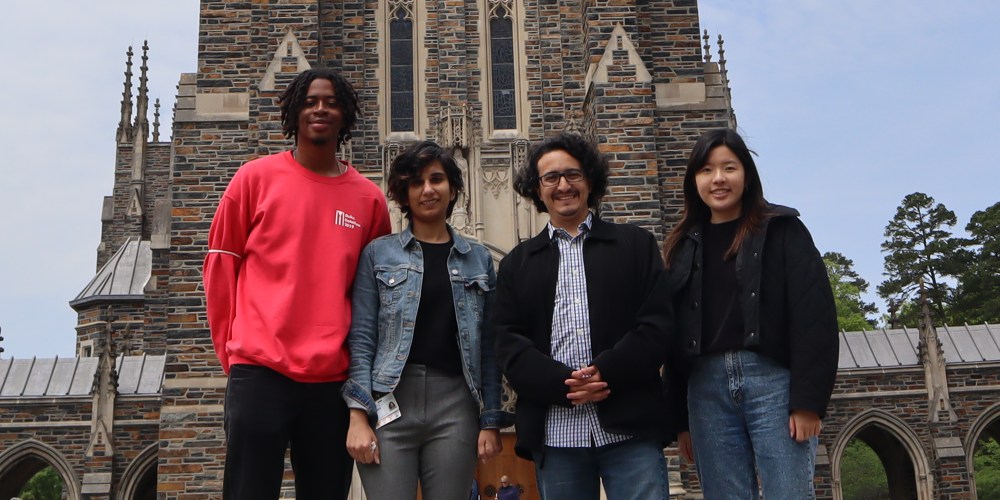

The Ochoa Lab is based in the department of [Biostatistics and Bioinformatics (B&B)](https://biostat.duke.edu/) at [Duke University](https://duke.edu), is part of the [Center for Statistical Genetics and Genomics](http://statgen.duke.edu), and is affiliated with [DIBS](https://dibs.duke.edu/) and the [CBB](https://genome.duke.edu/education/CBB) and [UPGG](https://upg.duke.edu/) PhD programs.

We study evolution and disease under **arbitrary relatedness**, with the underlying motivation of achieving greater equity in genetic studies.
We aim to improve:
* Measures of genetic differentiation and relatedness
* Genetic association statistics 
* Estimation of heritability
* Detection of genetic loci under selection
* Inference of genetic admixture

We are particularly interested in modeling admixed individuals, such as Hispanics and African-Americans, who derive their ancestry from Sub-Saharan Africa, the Americas, Europe, and other places.
Recently-admixed individuals vary dramatically in their ancestry composition, even among relatives, so their genetic correlations can be remarkably complex.
Accurate modeling of relatedness is necessary for multi-ethnic studies.

We are a multidisciplinary group that uses statistical models and develops software to study biology.
Members have a background in mathematics, molecular biology, computer science, and statistics.
Our approaches are scalable to large datasets, balancing accuracy with efficiency.
We have expertise in the False Discovery Rate (FDR) and Linear Mixed-Effects models (LMEs/LMMs).
Other topics of interest include modeling of protein sequences and longitudinal data.
We are interested in collaborative projects!
